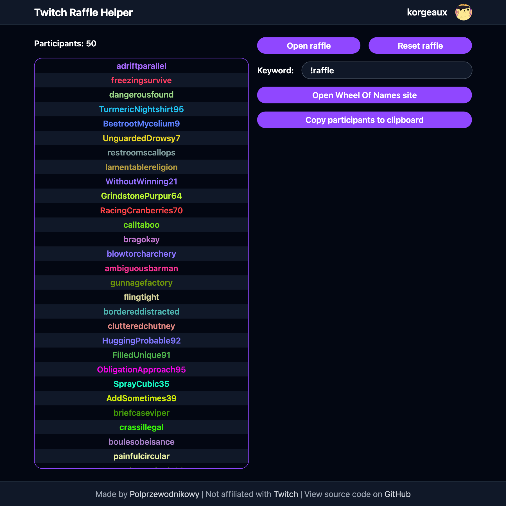

# Twitch Raffle Helper

An easy to use tool for gathering chatters entering a raffle. Just open https://polprzewodnikowy.github.io/TwitchRaffleHelper and login with Twitch.

## Features:

- Opening, closing and resetting the raffle
- Custom keyword (use empty keyword to catch all messages)
- Button to copy participants to clipboard
- Button to open [Wheel of Names](http://wheelofnames.com/) website with participants already filled in

## UI preview

